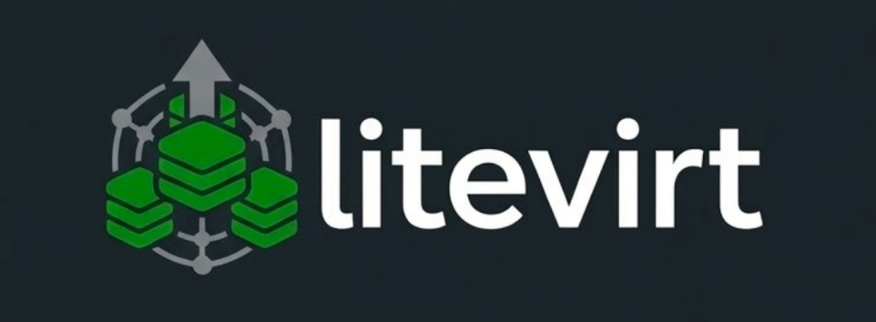

<p align="center">
  
</p>

# litevirt

Lightweight KVM/QEMU orchestrator. Single static binary, decentralized replication.

## Features

- **Single binary** — `litevirt` embeds everything: SQLite state store, WAL-based replication, gRPC API. No external databases, no sidecars, just `scp` and run.
- **Decentralized** — No master node. Every host is equal. State replicates via the Crescent protocol: relay-quorum topology with partitioned fan-out that scales to hundreds of nodes, backed by HLC-based last-writer-wins conflict resolution and anti-entropy drift detection.
- **Full VMs, not containers** — Run real KVM/QEMU virtual machines with UEFI, cloud-init, VNC console, and guest agent support. VMs can run Docker, Kubernetes, or any OS — they're full machines with their own kernels. Live migration moves running VMs between hosts with zero downtime, something containers on bare metal can't do.
- **mTLS everywhere** — Auto-generated ECDSA P-256 PKI. All API traffic is mutual TLS 1.3. Zero-trust between hosts.
- **Cloud-init provisioning** — NoCloud ISO generation for automatic VM bootstrapping with user-data and network config.
- **Docker Compose-style specs** — Define multi-VM stacks with familiar YAML. Placement constraints, anti-affinity, resource limits, service inheritance.
- **Networking** — Bridge, VXLAN overlays, isolated networks, and SR-IOV. Bridges are auto-created. Built-in DHCP/DNS via dnsmasq, host isolation to block VM→host traffic, and NAT/SNAT for outbound connectivity.
- **Live migration** — Move running VMs between hosts with pre-copy memory migration. Cold migration and storage migration also supported.
- **Automatic failover** — Quorum-based failure detection with IPMI/watchdog fencing. VMs are automatically rescheduled to healthy hosts.
- **Snapshots, backup & replication** — Point-in-time **disk and live/RAM snapshots** (`--memory` captures guest RAM so a revert resumes the running VM at that instant; repeatable), full disk export/import, scheduled deduplicated backups (PBS-style) with optional **application-consistent guest fs-freeze** (`--quiesce`), and cron-driven volume replication to a target pool (`keep_replicas` retention) — same-host, shared-storage, or cross-host to a peer. **Incremental** replication transfers only dirty extents; **promotion** (`lv replication promote`, manual or auto-on-fence) brings a VM up from its replica for disaster recovery.
- **Dynamic memory & boot order** — virtio memory **ballooning** (min/max with live `lv set-memory`) and Proxmox-style **autostart ordering** (`onboot`, `startup-order`, start/stop delays) that brings VMs up in sequence on host boot.
- **Load balancing** — Built-in HAProxy + keepalived VRRP load balancers defined in compose YAML. Drain, disable, sticky sessions, SNAT via VIP.
- **Hot-plug** — Attach and detach disks, NICs, and PCI devices (including GPU passthrough) on running VMs.
- **Resource mappings** — Cluster-wide aliases for equivalent passthrough devices so a VM requesting a device by mapping name can run on, or migrate to, any host that has one (`lv mapping`).
- **Built-in monitoring** — Prometheus metrics exporter, peer-to-peer health checking, event streaming, and per-host pressure metrics for the placement engine.
- **Notifications** — operator alerts (webhook + Slack) routed by event pattern + severity for backup failures, host fences, replication failures, and quota breaches (`lv notify`).
- **ACME / autocert** — optional auto-provisioned public TLS cert for the web UI from an ACME directory (internal step-ca or Let's Encrypt), with an internal-PKI fallback.
- **Web UI** — HTMX-based dashboard: VM **and container** lifecycle, VNC/SPICE/serial console, boot-from-ISO with a storage **content browser + ISO upload**, a cloud-init editor, **VM tags**, clone/template, stack deployment, networks, bulk operations, rebalance proposals, a cluster-wide **activity log**, audit log, themed confirm dialogs, and a **⌘K command palette**. No JavaScript build step.
- **REST API** — HTTP/JSON gateway on port 7446 with Server-Sent Events for streaming RPCs (migrate, drain, deploy).
- **Auth & RBAC** — local users + OIDC + LDAP realms; TOTP and WebAuthn 2FA; path-based RBAC with role bindings + propagation; scoped API tokens.
- **Smart placement** — Multi-dimensional weighted scoring (CPU, RAM, NUMA, host generation) with per-VM policies: `balance` (default), `bin-pack`, `spread-strict`, `cost-aware`. A leader-gated rebalancer proposes (or applies) live-migrations to flatten imbalance.
- **IPv6** — IPAM, dnsmasq router-advertisements, cloud-init network-config — first-class.
- **Witness host** — Vote-only tiebreaker for even-N quorum, no workloads.
- **Safe self-upgrade** — `lv host upgrade` with pre-flight gates (in-flight migrations, leader-lease, replication backlog), CRDT-replicated `upgrading` state that suppresses fence false-positives, and automatic rollback to the previous binary if the new one panic-loops. A host that was **down during an upgrade** auto-catches-up: it pulls the newer binary from a healthy peer and re-execs (downgrade-safe; `auto_upgrade.from_peer`, default on — see [docs/self-upgrade-from-peer.md](docs/self-upgrade-from-peer.md)).
- **DNS** — Embedded DNS server resolving `<vm>.<stack>.<domain>` to VM IPs. Records are created and removed automatically.
- **SSH-native CLI** — `lv` connects to any host via SSH tunnel. No VPN or special network setup required.

## Quick start

```bash
# Build
make build

# Single-node standalone (run on the host itself)
sudo cp bin/litevirt /usr/local/bin/
sudo ln -sf /usr/local/bin/litevirt /usr/local/bin/lv   # `lv` is a convenience alias
sudo litevirt host init --local --name node-1
sudo systemctl enable --now litevirt.service            # runs `litevirt daemon`

# Or remote bootstrap
# scp bin/litevirt root@10.0.50.10:/usr/local/bin/
# lv host init root@10.0.50.10 --name host-a

# Run a VM
export LV_HOST=root@127.0.0.1
lv image pull https://cloud-images.ubuntu.com/.../jammy-server-cloudimg-amd64.img --name ubuntu
lv run --name my-vm --image ubuntu --cpu 2 --memory 2048
lv ls
lv inspect my-vm
```

## Ports

| Port | Protocol | Purpose |
|------|----------|---------|
| 7443 | gRPC/mTLS | API |
| 7444 | HTTP | Prometheus metrics |
| 7445 | HTTP | Web UI |
| 7446 | HTTP | REST API |
| 7946 | TCP+UDP | Cluster membership |

## Documentation

See the [docs/](docs/) directory:

- [Installation](docs/installation.md) — Build from source, bootstrap a cluster, add hosts
- [Configuration](docs/configuration.md) — Daemon config file reference
- [CLI Reference](docs/cli-reference.md) — All `lv` commands and flags
- [Compose Stacks](docs/compose.md) — Multi-VM stack definitions with YAML
- [Networking](docs/networking.md) — Bridge, VXLAN, SR-IOV, IPv6
- [Storage](docs/storage.md) — Local, NFS, Ceph, and iSCSI backends
- [Migration & Failover](docs/migration-failover.md) — Live migration, health checking, fencing, witness hosts
- [Placement & Rebalancer](docs/placement.md) — Policy axes, named modes, scope chain, troubleshooting
- [Upgrades](docs/upgrades.md) — Pre-flight gates, upgrading state, auto-rollback, operator playbook
- [Operating Model](docs/operating-model.md) — Cluster guarantees and non-guarantees, recovery playbook
- [GPU & PCI Passthrough](docs/pci-passthrough.md) — Device assignment, SR-IOV VFs, hot-plug, resource mappings
- [Notifications](docs/notifications.md) — Webhook/Slack targets + event routes
- [REST API](docs/rest-api.md) — HTTP/JSON gateway for curl and CI scripts
- [Web UI](docs/ui.md) — Browser-based dashboard

## Build

```bash
make build
```

Produces a single binary `bin/litevirt` (~30 MB); `bin/lv` is a convenience symlink to it. `litevirt daemon` runs the server, `litevirt <cmd>` is the CLI (also as `lv <cmd>`). Requires Go 1.25+. No CGO.

## Test

```bash
make test
```
